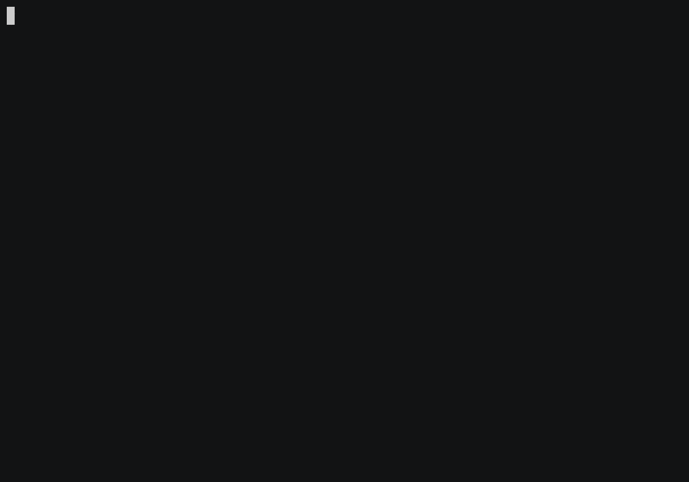

mdap
====

[](https://travis-ci.org/AjxLab/mdap)
[](https://rubygems.org/gems/mdap/)
[](LICENSE.txt)


A displaying progress utility for Ruby.



## Usage
### Description of Constructors's Argument
name            |Description
----------------|-------------------------------------------------------------------
n               | number of loops
desc            | progress's description
bar_shape       | Bar's character to display. Default value is ["\e[42m \e[0m", "─"]
indicator       | Character used for indicator. Default value is "⠻⠽⠾⠷⠯⠟".
datetime_format | Date and time format. Default value is '%M:%S'.

### Simple Example
```ruby
require 'mdap'

# 100 Loop
mdap(100) { sleep 0.01 }
# [#########################──────────] ⠟21% (72/100) [37:26-37:29 64.371566it/s]

# Specify Desc
mdap(100, desc: 'Download') { sleep 0.01 }
# Download: [##################───────] ⠟21% (72/100) [37:26-37:29 64.371566it/s]

# Specify Datetime Format
mdap(100, datetime_format: "%H:%M:%S") { sleep 0.01 }
# Download: [##############─────] ⠟21% (72/100) [03:37:26-03:37:29 64.371566it/s]

# Specify Bar Shape
mdap(100, bar_shape: ["=", "."]) { sleep 0.01 }
# Download: [==============.....] ⠟21% (72/100) [03:37:26-03:37:29 64.371566it/s]
```

### Indicator Example
```ruby
# No Indicator
mdap(100, indicator:nil)
# [#########################──────────] ⠟21% (72/100) [37:26-37:29 64.371566it/s]

# -\|/
mdap(100, indicator:"-\\|/")
# [#########################──────────] -21% (72/100) [37:26-37:29 64.371566it/s]
```

## Installation
```sh
$ gem install mdap
```
